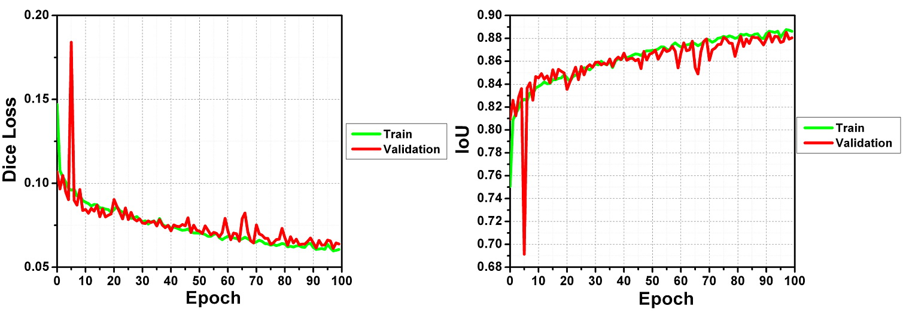
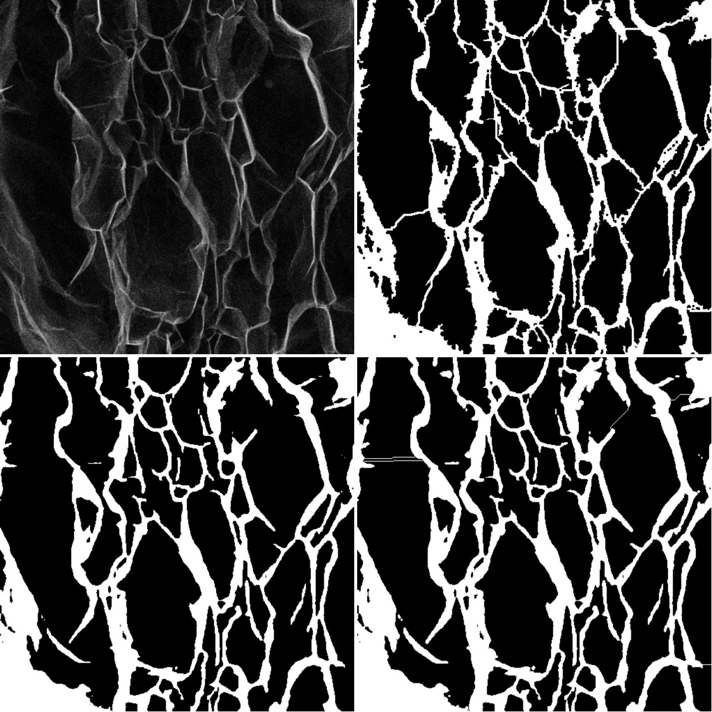
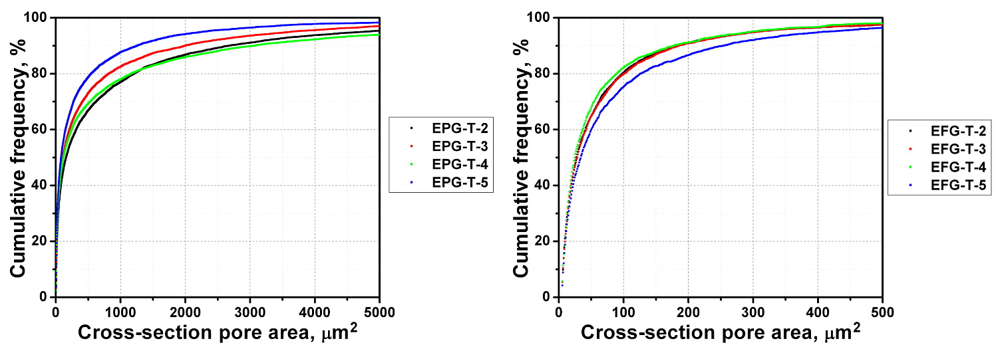

<h1 align="center">
Influence investigation of exfoliated graphite synthesis method on its macropore structure using neural network
</h1>

Aliaksei Krautsou, Olga N. Shornikova, Victor V. Avdeev

<h2 align="center">
Abstract
</h2>

Graphite intercalated compounds (GICs) with different stage numbers were prepared from highly oriented pyrolytic graphite (HOPG), natural flaked graphite (FG) and nitric acid in a chemical way. Exfoliated graphite samples (EG-T) were synthesized from GICs by water treatment followed by thermal shock. The purpose of this work is investigation of inner EG-T pore structure dependence on oxidation extent and graphite type by means of processing scanning electron microscopy (SEM) micrographs of EG-T cross-sections. For this purpose we created a method based on deep convolutional neural network, which speed up image processing significantly without considerable loss of accuracy. In this way we approved strong correlation between EG-T pore structure parameters and oxidation depth and type of graphite.

<h2 align="center">
Introduction
</h2>

Expanded graphite (EG-T) is widely used to manufacture seals, sorbents, etc [1–5]. Properties of these materials like gas permeability, sorption capacity are connected with, in particular, parameters of EG-T inner pore structure. One of the many technics to investigate material’s pore structure in a qualitative and quantitative manner  is scanning electron microscopy (SEM). Using this method, Inagaki and Suwa determined, that EG-T inner pore structure does not depend on thermal shock duration in the preparation process of EG-T from expandable graphite (EG) [6]. Moreover, authors found out, that EG-T bulk density doesn’t correlate with parameters of pore structure directly. For example, one of the EG-T samples with greater bulk density demonstrated less average pore size.

Inagaki et al. investigated influence of EG exfoliation temperature on EG-T pore structure and bulk density [7]. They ascertained that temperature increase from 600 ⁰C to 1000 ⁰C results in average size increment of inner pores and decrease in bulk density, i.e. increase in exfoliation volume. However, authors pointed out high increasing rate of EG-T exfoliation volume in comparison with inner pore growth in the range of 600 – 800 ⁰C. Above 800 ⁰C increase in exfoliation volume becomes slow, but pores grow more.

In the work [8] pore development during exfoliation of EG prepared from natural graphite bisulfate with various intercalate amount is studied. Authors determined that inner pore structure parameters do not depend on intercalate content. But increase in intercalate amount deals with EG-T bulk density decrease. Thus, authors suggest that pores among EG-T particles play a crucial role in this case.

The authors of the mentioned works processed SEM images of EG-T pore structure manually. But this approach takes a lot of time and connects with authors’ subjective view, for example, when thresholding parameter is set. To work around this problem the approach associated with usage of deep neural networks can be useful. For instance, deep learning models based on U-Net architecture are applied to segment X-ray computed tomography (XCT) scans of a porous material and samples of various rocks [9,10].

In the present work we synthesised EG-T samples based on highly oriented pyrolytic graphite nitrate and natural flaked graphite nitrate of different stage numbers to investigate dependence of graphite matrix oxidation degree and a graphite type on inner macropore structure by means of SEM technique and processing acquired images using an approach based on the feature pyramid network (FPN) [11].

<h2 align="center">
Experimental
</h2>
<h3 align="center">
Sample preparation
</h3>

We prepared two series of graphite intercalated compounds (GICs) with various stage numbers from 2 to 5 using nitric acid and two types of graphite as precursors: natural flaked graphite (FG) (GK China +597, ash content 2.5 % wt., flake size 250 – 315 μm) and highly oriented pyrolytic graphite (HOPG) (spread angle 0.9⁰). To synthesize n-stage HOPG nitrate we mixed approx. 500 mg HOPG and excess of nitric acid solution of certain concentration (approx. 50 ml) and left the mixture to rest for 1 day (Table 1). We used rectangular HOPG particles with size of approx. 3 x 4 mm. Further, we treated GICs by excess of distilled water for 5 min at room temperature, dried them on air for 1 day and exposed to thermal shock for 15 s at 900 ⁰C to obtain exfoliated graphite samples (EPG-T).

<table align="center">
<caption align="center">
Table 1. Concentration and mass of nitric acid solutions used to synthesize n-th stage GICs. In the case of HOPG nitrate we used excess of acid. To prepare FG nitrate 5 g graphite is used.
</caption>
<tr>
	<th rowspan="2">GIC stage number</th>
	<th>HOPG nitrate</th>
	<th colspan="2">FG nitrate</th>
</tr>
<tr>
	<th>w(HNO3), %</th>
	<th>w(HNO3), %</th>
	<th>m(HNO3 solution), g</th>
</tr>
<tr align="center">
	<td>2</td>
	<td>97.8 (fuming)</td>
	<td>92.9</td>
	<td>4.02</td>
</tr>
<tr align="center">
	<td>3</td>
	<td>87.6</td>
	<td>86.7</td>
	<td>4.31</td>
</tr>
<tr align="center">
	<td>4</td>
	<td>81.1</td>
	<td>81.2</td>
	<td>4.60</td>
</tr>
<tr align="center">
	<td>5</td>
	<td>77.9</td>
	<td>77.8</td>
	<td>4.80</td>
</tr>
</table>

To prepare analogous samples from FG we added a certain amount of nitric acid to 5 g graphite and left it under magnetic stirring for 1 h (stage 2 and 3) or 3 h (stage 4 and 5). After that, we treated products by 180 ml distilled water for half an hour at room temperature under magnetic stirring. Obtained expandable graphites were separated using glass filter, washed 3 times by 75 ml distilled water, dried on air for 1 day and exposed to thermal shock for 15 s at 900 ⁰C with exfoliated graphite (EFG-T) formation.

Formation of n-stage graphite nitrate was confirmed by XRD analysis using a X-ray diffractometer Rigaku Ultima IV (CuKα-radiation). XRD patterns coincide with that of literature data. Moreover, intercalant distance equals to ≈7.84 Å for all samples being also in correspondence with previous works.

<h3 align="center">
Acquisition of SEM images
</h3>

To acquire SEM micrographs of inner pore structure of EG-T samples we made slices of 40 particles for each sample in the following way. In the case of EPG-T a shallow longitudinal incision was made at the particle. Then the particle was torn along the incision and placed on conductive carbon scotch tape fixed on a SEM mount. EFG-T particles were directly torn by means of carbon scotch tape fixed on a SEM mount. Finally, we made micrographs of obtained cross-sections using acceleration voltage of electron beam equal to 10 kV on a TESCAN VEGA3 LMU microscope. We saved them as one-channel 8-bit images, each pixel takes the integer value in the range of 0 – 255.

<h3 align="center">
Generation of binary masks
</h3>

We processed acquired SEM images of inner EG-T pore structure by means of ImageJ software tools manually. First, we set scale to convert pixel size to metric system. Length of pixel along x- and y-axis (equal in our case) can be found in hdr-files, that were saved by microscope software after image acquisition. Then visually reasonable brightness and contrast of image were set. So, dark pores and bright pore walls became more distinguishable. After that we manually set rational value of threshold parameter to split all pixels into two classes – black and white pixels – corresponding to pore and pore walls, respectively. We saved them as one-channel 8-bit images, each pixel takes the value of 0 or 1.

Abovementioned manual segmentation approach takes a lot of time per an image. Thus, we decided to use deep neural network to solve this problem.

<h3 align="center">
Dataset generation
</h3>

At the moment there are 240 (= 2 types of graphite x 4 GIC stages x 30 particles of a sample) raw SEM images and 240 corresponding binary masks. It is too little to train deep neural network with good accuracy. Thus, we augmented existing image/mask pairs by means of random crop (512 x 512 px) followed by random rotation by an angle multiple of 90⁰. We performed this procedure 40 times for each image/mask pair. We split the dataset into train and validation datasets in a ratio of 85:15. To create a test dataset we repeated mentioned augmentation procedure 6 times for each pair to obtain a dataset of size equal to the validation dataset. So, size of train, validation and test dataset is 8160, 1440 and 1440, respectively.

<h3 align="center">
Model train, validation and test
</h3>

Our work was performed in Google Colab environment with the use of PyTorch framework based on the Torch library and the Python programming language. To segment SEM images of inner EG-T pore structure we selected a FPN model realized in a Segmentation Models library. We chose efficiennet-b4 encoder developed by Google due to good combination of accuracy, required memory and, as a consequence, satisfactory training time. On the stage of model training and validation we set maximum possible batch size equal to 11, applied the Adam optimization algorithm with learning rate 0.001 and used sigmoidal function on the last layer of neural network. The training/validation process was going on for 100 epochs. Dice’s coefficient was applied as loss function to calculate segmentation model error using ground-truth and predicted binary masks. Additionally we used intersection over union (IoU) metric to evaluate the accuracy of the model on the dataset. One can see the evolution of mentioned metrics on the figure 1. It can be noted that metrics reach almost a plateau. Thus, increasing of the epoch number will not improve the model performance significantly. Additionally, it can be noticed that the model overfitting does not occur.

Fig. 1. Evolution of Dice loss function and IoU metric during train/validation process.

On the test stage model demonstrated Dice’s loss and IoU metric equal to 0.0661 and 0.877, respectively.

An example of segmentation model’s results is given on the figure 2 (left bottom). One can note that pore walls have gaps in many cases. This artefact will affect results of pore area measurement, because two distinct pores having pore wall with even the only pixel gap will be considered as one big pore.

<h3 align="center">
Watershed algorithm post-processing
</h3>

To solve abovementioned problem of pore walls’ gaps we applied the watershed algorithm to binary mask predicted by the deep neural network. To perform this algorithm it should mark sure background and foreground. We set pore walls, i.e. white regions of binary mask, as background markers. To create foreground markers an Euclidian distance map was computed. On the map a value of each pixel is a measure of distance between corresponding pixel and background of the binary mask. Then we made thresholding of each region of the map, corresponding to closed areas, using an optimized thresholding parameter (see below) with the aim of extracting binary mask’s regions belonging to pores with a high probability. Finally, using the watershed algorithm, realized in the OpenCV library, and obtained markers, we processed predicted binary mask. One can note significant decrease of pore walls’ gaps on the figure 2 (right bottom).

Fig. 2. Original pore structure SEM image, ground-truth mask, predicted mask and post-processed predicted mask (from left top to right bottom). 

<h3 align="center">
Optimization of thresholding parameter of the watershed algorithm
</h3>

To calculate efficiency of the binary mask post-processing by means of the watershed algorithm, we measured the areas of each pore, i.e. closed regions of black pixels, on the ground-truth and corresponding post-processed predicted masks. Then we plotted two histograms with bin width of 100 squared pixels and calculated degree of their intersection using IoU metric. It is clear that greater IoU value corresponds to better quality of the post-processing algorithm.

We calculated average IoU metric on the dataset of 3000 binary masks using the abovementioned procedure for each thresholding parameter in the range of 0.01 – 0.99 with a step of 0.02. Optimal thresholding parameter corresponds to maximum value of the average IoU metric and equals to 0.41.

<h2 align="center">
Results and discussion
</h2>

We measured pore cross-section areas for not previously used 10 (for each stage number) EPG-T samples using ground-truth binary masks of SEM images by means of ImageJ software. As earlier we used scale information in hdr-files to convert squared pixels into squared microns. Then, we plotted frequency histograms with bin width of 1 μm2 in the range from 5 μm2 to the maximum existing value. We set the lower limit of the histograms to exclude very small pores which may be the result of inaccurate image processing. Finally, we transformed frequency histograms to the cumulative ones to make the difference between samples more clear (fig. 3).

Fig. 3. Cumulative frequency distributions of EPG-T-2 – EPG-T-5 samples obtained in a manual manner. Numbers in the sample labels equal to stage number of corresponding GICs.

To do the same thing by means of the automatic procedure based on the neural network it should predict binary masks with the size of initial SEM images. But our model can only work with images with the size of 512x512 pixels. Therefore, we cut each SEM image into pieces of shape 512x512 pixels, made prediction and processing by the watershed algorithm and pasted resulting binary masks together to get the masks of the same size as the original one. If size of the SEM image along any axis was not a multiple of 512, we preliminarily padded it to the size of 512 pixels by means of white pixels with a 255 value (fig. 4). As in the case of figure 3, to plot each cumulative curve on the figure 4 we took not previously used SEM images of inner pore structure of 10 EG-T particles.

Fig. 4. Cumulative frequency distributions of EPG-T-2 – EPG-T-5 (left) and EFG-T-2 – EFG-T-5 (right) samples obtained using the neural network. Numbers in the sample labels equal to stage number of corresponding GICs.

At first, one can note that cumulative distributions for EPG-T samples, obtained in a manual (fig. 3) and automatic (fig. 4, left) way, are quite identical. Two different approaches led to nearly similar qualitative and quantitative results. Thus, our approach based on deep neural network can be applied to solve a segmentation problem and plot pore size distributions for exfoliated graphite with a good accuracy.

At second, concerning to pore structure of EPG-T samples, it was found that size of 90 % pores is less than ≈1500 (EPG-T-5) – 3500 (EPG-T-2) μm2 (fig. 4, left). At the same time the upper limit of 90 % EFG-T pores is ≈200 (EFG-T-2) – 300 (EFG-T-5) μm2 (fig. 4, right). Thus, pores of EG-T samples based on natural graphite are an order of magnitude smaller than ones of exfoliated graphite based on HOPG.

Further, comparing cumulative distributions of the EPG-T samples corresponding to different GIC’s stage numbers, we found that the EPG-T-5 contains the largest relative amount of small pores, and the EPG-T-2 has the least one (fig. 4, left). So, oxidation degree of graphite matrix at a HOPG nitrate synthesis stage affects EPG-T inner pore structure parameters.

The situation is strongly different in the case of exfoliated graphite based on natural graphite. The samples from EFG-T-2 to EFG-T-4 have nearly identical cumulative pore size distributions (fig. 4, right). So, oxidation degree of natural graphite at the GICs preparation stage does not influence inner EG-T pore structure in some range of GIC’s stage numbers. This result is in correspondence with works [8,12], concerning to EG-T based on natural graphite bisulfate. But cumulative curve of the EFG-T-5 is different. Thus, some pore structure dependence on oxidation degree of graphite does still exist. Moreover, the EFG-T-5 contains the smallest relative amount of small pores than the other EFG-T samples. It is opposite to the case of the EPG-T pore structure.

<h2 align="center">
Conclusions
</h2>

In the issue, we studied the effect of oxidation degree of graphite by nitric acid and used type of graphite on inner pore structure parameters of exfoliated graphite by means of SEM image processing approach. For this purpose we created a method based on deep convolutional neural network, which speed up image processing significantly without considerable loss of accuracy. Influence of oxidation degree on cross-section pore areas is strongly different, when we compare EG-T based on HOPG and natural graphite. Namely, less intensive oxidation promotes inner pore structure with a large relative amount of small pores in the case of HOPG. Exfoliated graphite based on natural graphite demonstrates an opposite dependence. Furthermore, EFG-T pores are an order of magnitude smaller than ones of exfoliated graphite based on HOPG.

<h2 align="center">
References
</h2>

[1]	Chung D.D.L. // J. Mater. Sci. 2016. V. 51. № 1. P. 554. https://doi.org/10.1007/s10853-015-9284-6.

[2]	Nayak S.K., Mohanty S., Nayak S.K. // High Perform. Polym. 2019. V. 32. № 5. P. 506. https://doi.org/10.1177/0954008319884616.

[3]	Sorokina N.E., Redchitz A.V., Ionov S.G., et al. // J. Phys. Chem. Solids. 2006. V. 67. № 5–6. P. 1202. https://doi.org/10.1016/j.jpcs.2006.01.048.

[4]	Inagaki M., Kang F., Toyoda M., et al. // Advanced Materials Science and Engineering of Carbon. New-York: Elsevier, 2014. P. 313–334. https://doi.org/10.1016/B978-0-12-407789-8.00014-4.

[5]	Wang Z., Han E., Ke W. // Corros. Sci. 2007. V. 49. № 5. P. 2237. https://doi.org/10.1016/j.corsci.2006.10.024.

[6]	Inagaki M., Suwa T. // Carbon. 2001. V. 39. № 6. P. 915. https://doi.org/10.1016/S0008-6223(00)00199-8.

[7]	Inagaki M., Tashiro R., Washino Y., et al. // J. Phys. Chem. Solid. 2004. V. 65. № 2–3. P. 133. https://doi.org/10.1016/j.jpcs.2003.10.007.

[8]	Inagaki M., Saji N., Zheng Y.-P., et al. // TANSO. 2004. V. 2004. № 215. P. 258. https://doi.org/10.7209/tanso.2004.258.

[9]	Bellens S., Vandewalle P., Dewulf W. // Procedia CIRP. 2020. V. 96. P. 336. https://doi.org/10.1016/j.procir.2021.01.157.

[10]	Varfolomeev I., Yakimchuk I., Safonov I. // Computers. 2019. V. 8. № 4. P. 72. https://doi.org/10.3390/computers8040072.

[11]	Li X., Lai T., Wang S., et al. // Weighted feature pyramid networks for object detection. 2019 IEEE Intl Conf Parallel Distrib. Process. with Appl. Big Data Cloud Comput. Sustain. Comput. Commun. Soc. Comput. Networking, 2019. P. 1500. https://doi.org/10.1109/ISPA-BDCloud-SustainCom-SocialCom48970.2019.00217.

[12]	Kang F., Zheng Y.-P., Wang H.-N., et al. // Carbon. 2002. V. 40. № 9. P. 1575. https://doi.org/10.1016/S0008-6223(02)00023-4.
